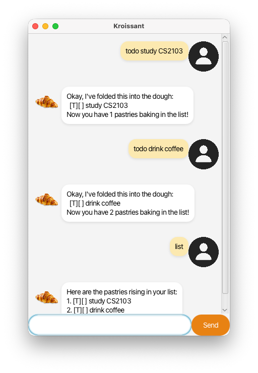

# Kroissant User Guide

Kroissant is a desktop app for managing tasks, customized for those who prefer typing to clicking. It allows you to track your todos, deadlines, and events with a simple command-line interface wrapped in a GUI.

## Quick Start

1.  Ensure you have Java 11 or above installed in your Computer.
2.  Download the latest `kroissant.jar` from the releases page (if available) or clone the repository.
3.  Navigate to the project directory and run the application using `gradlew run` or `java -jar kroissant.jar` if you have the jar.
4.  Type the command in the command box and press Enter to execute it. e.g. typing `help` and pressing Enter will open the help window.
5.  Some example commands to try:
    *   `list`: Lists all tasks.
    *   `todo read book`: Adds a todo task named "read book".
    *   `delete 1`: Deletes the 1st task shown in the current list.
    *   `bye`: Exits the app.

## Features

### Non-Argument Commands

#### Listing all tasks: `list`
Shows a list of all tasks in the task list.

Format: `list`

#### Exiting the program: `bye`
Exits the program.

Format: `bye`

### Task Management

#### Adding a todo: `todo`
Adds a standard todo task to the task list.

Format: `todo <description>`

Example: `todo Buy croissants`

#### Adding a deadline: `deadline`
Adds a task with a deadline to the task list.

Format: `deadline <description> /by <date/time>`

Example: `deadline Submit report /by 2026-02-14`

#### Adding an event: `event`
Adds an event with a start and end time to the task list.

Format: `event <description> /from <start> /to <end>`

Example: `event Team meeting /from Mon 2pm /to 4pm`

#### Deleting a task: `delete`
Deletes the specified task from the task list.

Format: `delete <index>`

*   Deletes the task at the specified `index`.
*   The index refers to the index number shown in the displayed task list.
*   The index **must be a positive integer** 1, 2, 3, …

Example: `delete 3` (Deletes the 3rd task in the list)

#### Marking a task as done: `mark`
Marks a task as completed.

Format: `mark <index>`

*   Marks the task at the specified `index` as done.
*   The index refers to the index number shown in the displayed task list.
*   The index **must be a positive integer** 1, 2, 3, …

Example: `mark 1` (Marks the 1st task as done)

#### Unmarking a task: `unmark`
Marks a task as not done.

Format: `unmark <index>`

*   Marks the task at the specified `index` as not done.
*   The index refers to the index number shown in the displayed task list.
*   The index **must be a positive integer** 1, 2, 3, …

Example: `unmark 1` (Marks the 1st task as not done)

#### Finding tasks by keyword: `find`
Finds tasks whose names contain the given keyword.

Format: `find <keyword>`

*   The search is case-sensitive.
*   The order of the keywords does not matter.
*   Only the name is searched.
*   Partial words will be matched e.g. `book` will match `books`.

Example: `find book` (Returns `todo read book` and `deadline return book`)

## FAQ

**Q**: How do I save my data?
**A**: Kroissant data is saved in the hard disk automatically after any command that changes the data. There is no need to save manually.

**Q**: Where is my data saved?
**A**: The data is saved in a file named `tasks.ser` in the project root directory.

## Command Summary

| Action | Format, Examples |
| :--- | :--- |
| **Add Todo** | `todo <description>`   e.g., `todo read book` |
| **Add Deadline** | `deadline <description> /by <date>`   e.g., `deadline return book /by Sunday` |
| **Add Event** | `event <description> /from <start> /to <end>`   e.g., `event project meeting /from Mon 2pm /to 4pm` |
| **List** | `list` |
| **Delete** | `delete <index>`   e.g., `delete 3` |
| **Mark** | `mark <index>`   e.g., `mark 1` |
| **Unmark** | `unmark <index>`   e.g., `unmark 1` |
| **Find** | `find <keyword>`   e.g., `find book` |
| **Bye** | `bye` |